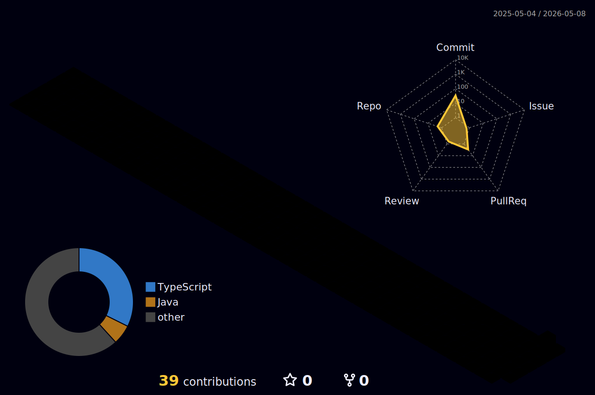

<div align="center">

#  ABDUL AZEEM



[](https://git.io/typing-svg)

<p align="center">
  <a href="https://github.com/AbdulAzeem-10/AbdulAzeem10-codearade/actions/workflows/snake.yaml">
    
  </a>
  <a href="https://github.com/AbdulAzeem-10/AbdulAzeem10-codearade/actions/workflows/update-activity.yaml">
    
  </a>
  <a href="https://github.com/AbdulAzeem-10/AbdulAzeem10-codearade/actions/workflows/metrics.yaml">
    
  </a>
  <a href="https://github.com/AbdulAzeem-10/AbdulAzeem10-codearade/actions/workflows/profile-3d.yaml">
    
  </a>
</p>

```ascii
┌─────────────────────────────────────────────────────────────────────┐
│  > system.status                                                     │
│  ✓ Location: Peshawar, Pakistan                                     │
│  ✓ Role: Co-Founder & Full-Stack Developer @ BlancosHQ              │
│  ✓ Education: BS Computer Science @ FAST-NUCES                      │
│  ✓ Mission: Transforming Ideas into Digital Reality                 │
│  ✓ Stack: MERN | TypeScript | PostgreSQL | React Native             │
└─────────────────────────────────────────────────────────────────────┘
```


### 🎯 CURRENT MISSION

```javascript
const abdulAzeem = {
    location: "Peshawar, Pakistan 🇵🇰",
    company: "BlancosHQ",
    role: "Co-Founder & Full-Stack Developer",
    education: "FAST-NUCES",
    currentFocus: ["Backend Architecture", "MERN Stack", "Client Solutions"],
    techStack: {
        frontend: ["React", "Next.js", "TypeScript", "Tailwind CSS", "Framer Motion"],
        backend: ["Node.js", "Express", "PostgreSQL", "Prisma ORM"],
        mobile: ["React Native"],
        tools: ["Git", "Linux", "Railway", "Render"],
        learning: ["Advanced Backend Patterns", "System Design"]
    },
    motto: "We build what others imagine ✨"
};
```


## 🔥 STREAK STATS

<p align="center">
  
</p>

## 📊 SYSTEM ANALYTICS

<p align="center">
  
  
</p>

<p align="center">
  
</p>

<p align="center">
  
  
</p>

<p align="center">
  
  
</p>

## 🏆 ACHIEVEMENT UNLOCKED

<p align="center">
  
</p>

<p align="center">
  
</p>


## 💻 TECH ARSENAL

```text
┌─────────── FRONTEND ───────────┐  ┌─────────── BACKEND ────────────┐
│ React.js        ████████░ 90%  │  │ Node.js         ████████░ 85%  │
│ Next.js         ███████░░ 80%  │  │ Express.js      ████████░ 85%  │
│ TypeScript      ████████░ 85%  │  │ PostgreSQL      ███████░░ 75%  │
│ Tailwind CSS    █████████ 95%  │  │ MongoDB         ████████░ 80%  │
│ JavaScript      █████████ 95%  │  │ Prisma ORM      ███████░░ 70%  │
└────────────────────────────────┘  └────────────────────────────────┘

┌──────────── MOBILE ────────────┐  ┌───────── TOOLS & OTHER ────────┐
│ React Native    ███████░░ 75%  │  │ Git             █████████ 90%  │
│ Three.js        ██████░░░ 65%  │  │ Linux           ████████░ 80%  │
│ WebXR/AR        ██████░░░ 60%  │  │ Python          ███████░░ 75%  │
└────────────────────────────────┘  │ C++             ███████░░ 70%  │
                                     └────────────────────────────────┘
```

<p align="center">
  
</p>


## 🎯 CODING PROFILES

<p align="center">
  <a href="https://leetcode.com/u/abdulazeem_10/">
    
  </a>
  <a href="https://www.hackerrank.com/abdulazeemjd">
    
  </a>
</p>

### 📈 LeetCode Stats

<p align="center">
  
</p>


## 🌐 CONNECT WITH ME

<p align="center">
  <a href="mailto:abdulazeemjd@gmail.com">
    
  </a>
  <a href="https://linkedin.com/in/abdul-azeem-a253b92a3">
    
  </a>
  <a href="https://github.com/AbdulAzeem-10">
    
  </a>
  <a href="mailto:hqblancos@gmail.com">
    
  </a>
</p>

<p align="center">
  
  
</p>


## 🐍 CONTRIBUTION GRAPH

<picture>
  <source media="(prefers-color-scheme: dark)" srcset="https://raw.githubusercontent.com/AbdulAzeem-10/AbdulAzeem10-codearade/output/github-contribution-grid-snake-dark.svg">
  <source media="(prefers-color-scheme: light)" srcset="https://raw.githubusercontent.com/AbdulAzeem-10/AbdulAzeem10-codearade/output/github-contribution-grid-snake.svg">
  
</picture>

<details>
<summary>🎨 3D Contribution Graph</summary>
<br>

<p align="center">
  
</p>

</details>


## 💼 BLANCOSHQ

```bash
$ cat blancoshq.info
────────────────────────────────────────────────
🏢 Company: BlancosHQ
🌐 Website: blancoshq.com
📧 Email: hqblancos@gmail.com
📱 Phone: +92 318 9177303
💡 Tagline: "We build what others imagine"
────────────────────────────────────────────────
Services:
  ✓ Web Development (React, Next.js, Node.js)
  ✓ Mobile Development (React Native)
  ✓ Backend Architecture (PostgreSQL, Prisma)
  ✓ AR/VR Solutions (Three.js, WebXR)
────────────────────────────────────────────────
Team:
  • Abdul Azeem - Co-Founder & Full-Stack Dev
  • Syed Khadeen - Co-Founder & Backend Architect
  • Ikrama Shah - Co-Founder & AR/VR Specialist
────────────────────────────────────────────────
```


## 📝 RECENT ACTIVITY

<!--START_SECTION:activity-->
1. 🎯 Pushed code to [repository-name]
2. ⭐ Starred [interesting-repo]
3. 🔀 Merged PR in [project-name]
4. 💬 Commented on issue in [repo-name]
5. 🚀 Released new version of [project]
<!--END_SECTION:activity-->

<details>
<summary>📊 More Stats</summary>
<br>

<p align="center">
  
</p>

<p align="center">
  
</p>

</details>


## 🚀 FEATURED PROJECTS

<div align="center">

<a href="https://github.com/AbdulAzeem-10">
  
</a>

</div>

<details>
<summary>🔥 More Projects</summary>
<br>

### 💼 BlancosHQ Projects
- 🌐 **Client Web Applications** - Full-stack MERN solutions
- 📱 **Mobile Apps** - React Native cross-platform applications
- 🎨 **AR/VR Experiences** - Three.js and WebXR implementations
- 🔧 **Backend Systems** - Scalable Node.js + PostgreSQL architectures

### 🎯 Personal Projects
- 💻 **Portfolio Website** - Next.js + Tailwind CSS
- 🤖 **Automation Tools** - Python scripts for productivity
- 📊 **Data Visualization** - Interactive dashboards
- 🎮 **Game Development** - Experimental projects

</details>


<div align="center">

### 💚 Show Some Love

<p align="center">
  <a href="https://github.com/AbdulAzeem-10?tab=repositories">
    
  </a>
</p>

```ascii
╔══════════════════════════════════════════════════════════════╗
║  "Code is like humor. When you have to explain it,          ║
║   it's bad." – Cory House                                    ║
╚══════════════════════════════════════════════════════════════╝
```

<p align="center">
  
</p>

### 🎵 Currently Vibing To

<p align="center">
  
</p>


</div>
